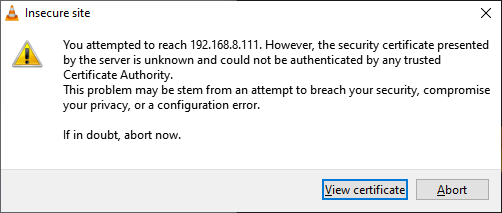
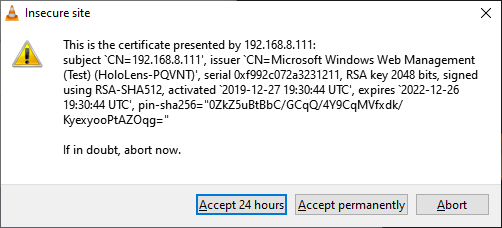
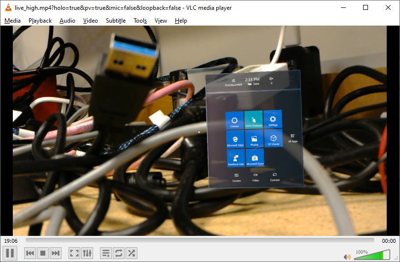
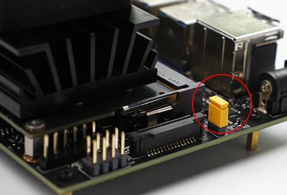

# Introduction

## Requirements

- Hololens
- PC  
  You can run Windows 10, Linux, or Mac.  You need :  
  - Browser
  - VS Code
  - SSH client
  - VLC Media Player  
    To check Hololens RTSP Stream
- Jetson Nano  
  - With 5V 4A AC Adapter
  - Do not use Micro USB Power Adapter (e.g. Raspberry Pi AC Adapter)
  - USB Keyboard and Mouse
  - HDMI Monitor
  - HDMI Cable
  - Webcam (Optional)  
      The default camera device is set for USB Webcam.  It's not required but highly recommended until you complete setting up your environment
- WiFi Access Point  
  Make sure your PC, Hololens, and Jetson Nano are on the same subnet  
  Check Connectivity with ping

## PC Setup

### 1. Install VSCode

Download and install the latest version of VSCode from [here](https://code.visualstudio.com/)

### 2. Install Azure IoT Edge extension

Install the extension from [here](https://marketplace.visualstudio.com/items?itemName=vsciot-vscode.azure-iot-edge)

### 3. Install SSH Client (Windows 10 Only)

Install your favorite SSH client such as [putty](https://putty.org/)

### 4. Install VLC Media Player

Download and install the latest version of VLC Media player for your OS from [here](https://www.videolan.org/vlc/)

### 5. Download deployment manifest

Clone this repo or download the deployment manifest to your PC.

To clone :

```bash
git clone https://github.com/daisukeiot/IoTEdge-Jetson-Nano.git
```

or download this and save to a local folder.

DeploymentManifest/deployment.arm64v8.json

## Hololens Setup

### 1. Enable Device Portal  

  Settings -> Update and Security -> For Developers  

  - Use Developer Features : On

  - Enable Device Portal : On

### 2. Open Hololens' Device Portal from your PC

e.g. http://<Hololens' IP address>

Enter PIN to pair

### 3. Check RTSP stream

1. Start VLC Media Player
1. Select 'Open Network Stream'  

    

1. Enter following to connect to Hololens  

    ```bash
    # Replace <User Name> and <Password> with Hololens' User Name and Password
    # Replace <IP Address> with Hololens' IP Address
    https://<User Name>:<Password>1@<IP Address>/api/holographic/stream/live_high.mp4?holo=true&pv=true&mic=false&loopback=false
    ```

    > [!NOTE]  
    > You may see Security Warning  
    >
    >   
    >
    > Select 'View Certificate' and accept certificate from Hololens  
    >
    > 

1. Make sure you can see video stream from Hololens  
  
    

## Jetson Nano Setup

### 1. Flash SD Card

Download SD Card Image from [here](https://developer.nvidia.com/jetson-nano-sd-card-image-r3231)

> [!NOTE]  
> This instruction is based on R32.3.1 Image

Follow the [instruction](https://developer.nvidia.com/embedded/learn/get-started-jetson-nano-devkit#write) to write SD Card Image to the micro SD card

### 2. Boot Jetson Nano

Insert the SD card into Jetson Nano.  Make sure to use 5V 4A AC Adapter and short jumper 48



Once Jetson Nano boots into Ubuntu, go though OOBE.

### 3. Install SSH server

Install SSH Server with :

```bash
sudo apt-get update && \
sudo apt-get install -y openssh-server
```

### 4. Connect to Jetson Nano

Connect to Jetson Nano from your SSH client app.

To find IP Address, type :

```bash
hostname -I
```

Example

```bash

jetson@jetson-nano:~$ hostname -I
192.168.8.130 172.17.0.1 172.18.0.1
jetson@jetson-nano:~$

192.168.8.130 is IP Address.  Others are from Container/Docker

```

With Windows :

1. Open your SSH Client App such as Putty
2. Connect to Jetson Nano by specifying IP Address of Jetson Nano

With Mac or Linux, open terminal then :

```bash
ssh <Jetson Nano User Name>@<Jetson Nano IP Address>
```

Example

```bash
jetson@P15-UP2-1:~$ ssh jetson@192.168.8.130
The authenticity of host '192.168.8.130 (192.168.8.130)' can't be established.
ECDSA key fingerprint is SHA256:QdUeF/6fZQeqSiRS12GbA07anR/5Lm9B92C/ycSAfhM.
Are you sure you want to continue connecting (yes/no)? yes
Warning: Permanently added '192.168.8.130' (ECDSA) to the list of known hosts.
jetson@192.168.8.130's password:
Welcome to Ubuntu 18.04.2 LTS (GNU/Linux 4.9.140-tegra aarch64)

 * Documentation:  https://help.ubuntu.com
 * Management:     https://landscape.canonical.com
 * Support:        https://ubuntu.com/advantage

This system has been minimized by removing packages and content that are
not required on a system that users do not log into.

To restore this content, you can run the 'unminimize' command.

280 packages can be updated.
142 updates are security updates.

Last login: Mon Jan  6 14:58:45 2020 from 10.123.96.71
```

### 5. Install IoT Ege and other tools

Install IoT Edge Runtime and other tools with :

```bash
sudo apt-get update && \
sudo apt-get install -y curl nano python3-pip && \
curl https://packages.microsoft.com/config/ubuntu/18.04/multiarch/prod.list > ./microsoft-prod.list && \
sudo cp ./microsoft-prod.list /etc/apt/sources.list.d/ && \
curl https://packages.microsoft.com/keys/microsoft.asc | gpg --dearmor > microsoft.gpg && \
sudo cp ./microsoft.gpg /etc/apt/trusted.gpg.d/ && \
sudo apt-get update && \
sudo apt-get install -y iotedge && \
sudo usermod -aG docker $USER
```

### 6. Create an IoT Edge Device

Create a new IoT Edge device in [Azure Portal](http://portal.azure.com) or VSCode

### 7. Set Connection String in /etc/iotedge/config.yaml

Edit `/etc/iotedge/config.yaml` with your favorite text editor (such as vi or nano).

Add Connection String for the IoT Edge Device you created.

```bash

sudo nano /etc/iotedge/config.yaml

```

Example

```bash
from :

# Manual provisioning configuration
provisioning:
  source: "manual"
  device_connection_string: ""

to :

# Manual provisioning configuration
provisioning:
  source: "manual"
  device_connection_string: "HostName=dndemohub.azure-devices.net;DeviceId=jetson-nano-hololens;SharedAccessKey=xxxxxxxxxxxxxxxxxxxx/******************"

```

### 7. Reboot Jetson Nano

```bash
sudo reboot now
```

### 8. Check IoT Edge Runtime

Upon reboot, IoT Edge Runtime will start pulling containers.  Check progress with :

```bash
journalctl -f -u iotedge

```

CTRL + C to exit.

Example

```bash
jetson@jetson-nano:~$ journalctl -f -u iotedge
-- Logs begin at Sun 2018-01-28 07:58:17 PST. --
Jan 06 16:10:39 jetson-nano iotedged[30964]: 2020-01-07T00:10:39Z [INFO] - [mgmt] - - - [2020-01-07 00:10:39.337822809 UTC] "GET /modules?api-version=2019-01-30 HTTP/1.1" 200 OK 449 "-" "-" auth_id(-)
Jan 06 16:10:44 jetson-nano iotedged[30964]: 2020-01-07T00:10:44Z [INFO] - [mgmt] - - - [2020-01-07 00:10:44.364565328 UTC] "GET /modules?api-version=2019-01-30 HTTP/1.1" 200 OK 449 "-" "-" auth_id(-)
Jan 06 16:10:49 jetson-nano iotedged[30964]: 2020-01-07T00:10:49Z [INFO] - [mgmt] - - - [2020-01-07 00:10:49.391273252 UTC] "GET /modules?api-version=2019-01-30 HTTP/1.1" 200 OK 449 "-" "-" auth_id(-)
Jan 06 16:10:54 jetson-nano iotedged[30964]: 2020-01-07T00:10:54Z [INFO] - [mgmt] - - - [2020-01-07 00:10:54.426916319 UTC] "GET /modules?api-version=2019-01-30 HTTP/1.1" 200 OK 449 "-" "-" auth_id(-)
Jan 06 16:10:59 jetson-nano iotedged[30964]: 2020-01-07T00:10:59Z [INFO] - [mgmt] - - - [2020-01-07 00:10:59.458306961 UTC] "GET /modules?api-version=2019-01-30 HTTP/1.1" 200 OK 449 "-" "-" auth_id(-)
Jan 06 16:11:04 jetson-nano iotedged[30964]: 2020-01-07T00:11:04Z [INFO] - [mgmt] - - - [2020-01-07 00:11:04.487878239 UTC] "GET /modules?api-version=2019-01-30 HTTP/1.1" 200 OK 449 "-" "-" auth_id(-)
Jan 06 16:11:09 jetson-nano iotedged[30964]: 2020-01-07T00:11:09Z [INFO] - Checking edge runtime status
Jan 06 16:11:09 jetson-nano iotedged[30964]: 2020-01-07T00:11:09Z [INFO] - Edge runtime is running.
Jan 06 16:11:09 jetson-nano iotedged[30964]: 2020-01-07T00:11:09Z [INFO] - [mgmt] - - - [2020-01-07 00:11:09.515029312 UTC] "GET /modules?api-version=2019-01-30 HTTP/1.1" 200 OK 449 "-" "-" auth_id(-)
Jan 06 16:11:14 jetson-nano iotedged[30964]: 2020-01-07T00:11:14Z [INFO] - [mgmt] - - - [2020-01-07 00:11:14.535655526 UTC] "GET /modules?api-version=2019-01-30 HTTP/1.1" 200 OK 449 "-" "-" auth_id(-)
Jan 06 16:11:19 jetson-nano iotedged[30964]: 2020-01-07T00:11:19Z [INFO] - [mgmt] - - - [2020-01-07 00:11:19.569574252 UTC] "GET /modules?api-version=2019-01-30 HTTP/1.1" 200 OK 449 "-" "-" auth_id(-)
```

### 9. Check Container Status

Make sure edgeAgent is running with :

```bash
docker ps
```

Example

```bash
jetson@jetson-nano:~$ docker ps
CONTAINER ID        IMAGE                                      COMMAND                   CREATED             STATUS              PORTS               NAMES
14fed2c8da88        mcr.microsoft.com/azureiotedge-agent:1.0   "/bin/sh -c 'echo \"$…"   2 hours ago         Up 2 hours                              edgeAgent
```

Make sure edgeAgent container's status is `Up`

If not, check docker logs with :

```bash
docker logs -f edgeAgent
```

### 10. Deploy Jetson-Nano-YoloV3 container

1. Start VSCode
1. Connect to IoT Hub
1. Open a folder that contains `deployment.arm64v8.json`
1. Right click `deployment.arm64v8.json`
1. Select `Create Deployment for Single Device`

Once containers are deployed, you should see 3 modules :

```bash

docker ps

CONTAINER ID        IMAGE                                       COMMAND                   CREATED             STATUS              PORTS                                                                  NAMES
jetson@jetson-nano:~$ docker ps
CONTAINER ID        IMAGE                                          COMMAND                   CREATED             STATUS              PORTS                                                                  NAMES
07a9b4f35e6d        daisukeiot/jetson_nano_yolov3:latest-arm64v8   "python3 -u ./main.py"    13 minutes ago      Up 13 minutes       0.0.0.0:80->80/tcp                                                     Jetson_Nano_YoloV3
fe3a62997c82        mcr.microsoft.com/azureiotedge-hub:1.0         "/bin/sh -c 'echo \"$…"   25 minutes ago      Up 25 minutes       0.0.0.0:443->443/tcp, 0.0.0.0:5671->5671/tcp, 0.0.0.0:8883->8883/tcp   edgeHub
7d30ba1ef93f        mcr.microsoft.com/azureiotedge-agent:1.0       "/bin/sh -c 'echo \"$…"   29 minutes ago      Up 27 minutes                                                                              edgeAgent
````

### 11. Connect to Web View

From your PC, start browser and connect to Jetson Nano.  (e.g. http://192.168.8.130)


### 12. Update Module Twin

Update Module Twin of `Jetson-Nano-YoloV3` module to connect to your Hololens

1. Make sure Hololens is running and connected to WiFi
1. In `AZURE IOT HUB` view, expand your Jetson Nano device until you see `Jetson-Nano-YoloV3`
1. Right click and select `Edit Module Twin`  

    

1. Add `VideoSource`  

    Make sure to set user name, password, and IP Address for your Hololens

    ```json
      :
    "version": 5,
    "properties": {
        "desired": {
            "ConfidenceLevel": "0.3",
            "VerboseMode": 1,
            "Inference": 1,
            "VideoSource": "https://<User Name>:<Password>@<IP Address>/api/holographic/stream/live_high.mp4?holo=true&pv=true&mic=false&loopback=false",
      :
    ```

1. Check Web UI

You should now see Holographic stream


## Tips

### Jetson Power Profile

If you do not have 5V 4A AC Adapter, you cannot run Jetson Nano at full speed.

Check which mode Jetson is running in with :

```bash
jetson@jetson-nano:~$ sudo nvpmodel -q
NVPM WARN: fan mode is not set!
NV Power Mode: MAXN
```

If you do not have 5V 4A AC Adapter, make sure to :

1. Disconnect Jumper 48
1. Set Power Profile to 5W mode with  

    ```bash
    sudo nvpmodel -m 1
    ```

Example :

```bash
sudo nvpmodel -m 1

sudo nvpmodel -q
NVPM WARN: fan mode is not set!
NV Power Mode: 5W
```

> [!WARNING]  
> Many AC Adapters supply less current than what it claims.  Make sure your AC Adapter supplies enough current (2A or 4A).  
> To check with voltage meter like [this](https://www.amazon.com/Diymore-Charging-Detector-Voltmeter-Multimeter/dp/B01L6Y3IMK/ref=asc_df_B01L6Y3IMK/?tag=hyprod-20&linkCode=df0&hvadid=309819400004&hvpos=1o2&hvnetw=g&hvrand=14876685810355741768&hvpone=&hvptwo=&hvqmt=&hvdev=c&hvdvcmdl=&hvlocint=&hvlocphy=9033288&hvtargid=pla-569138005859&psc=1&tag=&ref=&adgrpid=60510211606&hvpone=&hvptwo=&hvadid=309819400004&hvpos=1o2&hvnetw=g&hvrand=14876685810355741768&hvqmt=&hvdev=c&hvdvcmdl=&hvlocint=&hvlocphy=9033288&hvtargid=pla-569138005859)

### Camera Setting

There are 3 ways to specify video source.

1. In Container  
    This requires to re-build container.  
1. Through Module Twin  
    Explained in [above](#12-update-module-twin)
1. In Web UI  
    Click on `Camera Setting` and specify video source.
    

    > [!CAUTION]  
    > This is a temporary setting.  The setting will not stay when container restart (or system reboot)

### Error Code

Web UI displays the status of container.  

Example :

```bash
Error (CaptureDeviceState.ErrorNoNetwork): https://192.168.8.113/api/holographic/stream/live_high.mp4?holo=true&pv=true&mic=false&loopback=false
```

|Error             |Description                                    |Notes                                                                           |
|------------------|-----------------------------------------------|--------------------------------------------------------------------------------|
|ErrorOpen         | Container Could not open video source         | Check camera's (or Hololens') setting                                          |
|ErrorRead         | Camera opened, but failed to read from Camera | Check camera's (or Hololens') setting.  Maybe reboot the camera?               |
|ErrorNotSupported | Do not support this video source.             | Supported video sources are Webcam, RTSP Stream (e.g. IP Camera), and Hololens |
|ErrorNoNetwork    | Cannot connect to video source                | Ping failed         |

### Slow network

Depending on your network configuration, IoT Edge Runtime may hit timeout.  Try pulling from container registry manually.

1. Stop IoT Edge Runtime  

    ```bash
    sudo systemctl stop iotedge
    ```

1. Pull container  

    ```bash
    docker pull daisukeiot/jetson-nano-yolov3:latest-arm64v8
    ```

1. Start IoT Edge Runtime  

    ```bash
    sudo systemctl start iotedge
    ```
